# 🏫 School Management App

## 📋 Description

The **School Management App** is a web-based application designed to manage core school resources.  
This version currently focuses on **Teacher and Student Management**.

---

## ⚙️ Tech Stack

- **Java Spring Boot**
- **Java Spring Security**
- **Thymeleaf (Server-Side Rendering)**
- **JPA - Hibernate ORM**
- **Gradle** for dependency management
- **Tailwind CSS** for styling
- **CSRF Protection** via Spring Security
- **Reusable Thymeleaf Fragments**
- **Global Error Controller**
- **Mobile-First Responsive Design**

---

## 🧱 Architecture

The project follows the **Model-View-Controller (MVC)** architecture, enhanced with **Service-Oriented Design** and **Clean Architecture principles**.

- **Controllers:** Java Spring MVC controllers handle routing and business logic.
- **Views:** Server-rendered using Thymeleaf templates.
- **Services:** Encapsulate business logic and interact with repositories.
- **Repositories:** Interface with the database using JPA/Hibernate.

---

## 👤 Roles & Permissions

The system includes **Session-Based Authentication** and **Role-Based Authorization**:

| Role   | Description                                                        |
|--------|--------------------------------------------------------------------|
| `ADMIN`  | Full CRUD on Teachers, Students, Users & Regions (via Admin Panel) |
| `EDITOR` | CRUD on Teachers, Students                                         |
| `READER` | Read-only access to Teachers, Students                             |

---

## 🧩 Features

- ✅ Teacher Management (Insert, View, Update, Delete)
- ✅ Student Management (Insert, View, Update, Delete)
- ✅ User Management (Admin only)
- ✅ Region Management (Admin only)
- ✅ Authentication & Authorization (Session + Role-Based)
- ✅ CSRF Protection for all forms
- ✅ Global Error Handling (404, 500, etc.)
- ✅ Responsive UI built with Tailwind CSS
- ✅ Modular UI with reusable Thymeleaf fragments

---

## 🚀 Getting Started 

> Requires JDK 17+, Gradle, and a MySQL Database

1. Clone the repository:
```bash
git clone git@github.com:nickTheof/spring-ssr-schoolapp.git
cd spring-ssr-schoolapp
```

2. Set up the database in `application.yml` or `application.properties`.

3. Run the application:
```bash
./gradlew bootRun
```


## ⚙️ Setup Instructions

### 1️⃣ Create the Database & User

Use MySQL to create the database schema and user for the application:

```sql
CREATE DATABASE school_app;
CREATE USER 'school_user'@'localhost' IDENTIFIED BY 'your_password';
GRANT ALL PRIVILEGES ON school_app.* TO 'school_user'@'localhost';
FLUSH PRIVILEGES;
```

### 2️⃣ Configure Application Properties

Update the connection details and other environment variables in:

```
src/main/resources/application.properties
src/main/resources/application-test.properties
src/main/resources/application-prod.properties
src/main/resources/application-stage.properties
```

### 3️⃣ Manually Create the First Admin User

Insert an admin user manually into your MySQL database with a **BCrypt-hashed password**.

```sql
INSERT INTO users (username, password, role, is_active, created_at, updated_at, uuid)
VALUES (
  'admin@example.com',
  '$2a$10$abcdefghijk1234567890hashedPasswordHere',
  'ADMIN',
  true,
  NOW(),
  NOW(),
  UUID()
);
```

### 4️⃣ Preload Regions (First Run Only)

To preload **region** data using SQL script:

1. Uncomment the following in `application.properties`:

```properties
spring.sql.init.mode=always
spring.sql.init.data-locations=classpath:sql/regions.sql
```

2. Run the application to load default region data.

3. **Then comment the init mode again** to avoid re-initialization:

```properties
# spring.sql.init.mode=always
```

---


---

## 📁 Folder Structure (Brief)
```
src/
├── main/
│   ├── java/gr/aueb/cf/schoolspring/
│   │   ├── authentication/
│   │   ├── controller/
│   │   ├── core/
│   │   ├── dto/
│   │   ├── mapper/
│   │   ├── service/
│   │   ├── repository/
│   │   └── model/
│   └── resources/
│       ├── sql/
│       ├── templates/
│       └── static/
```

---

## 🖼️ Screenshots

### 🔐 Authentication
- **Login Page**  
  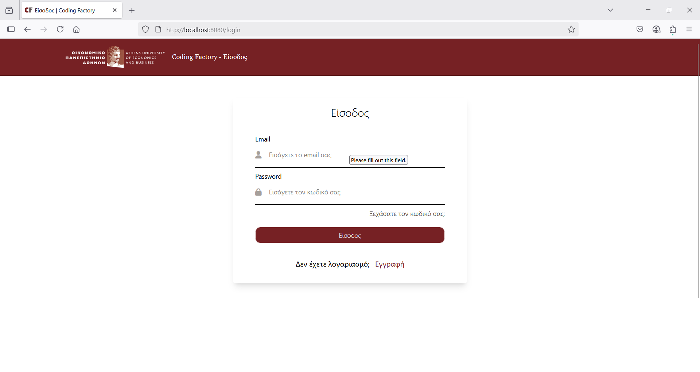
- **User Registration**  
  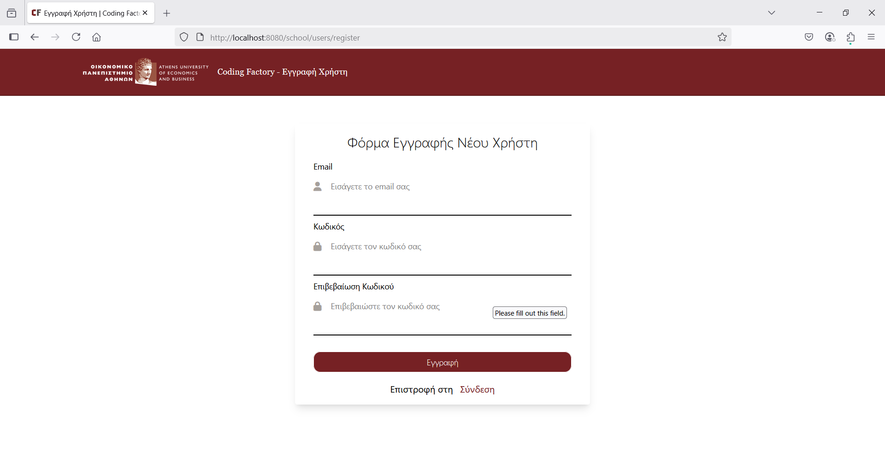

### 🎯 Dashboards
- **Landing Page**  
  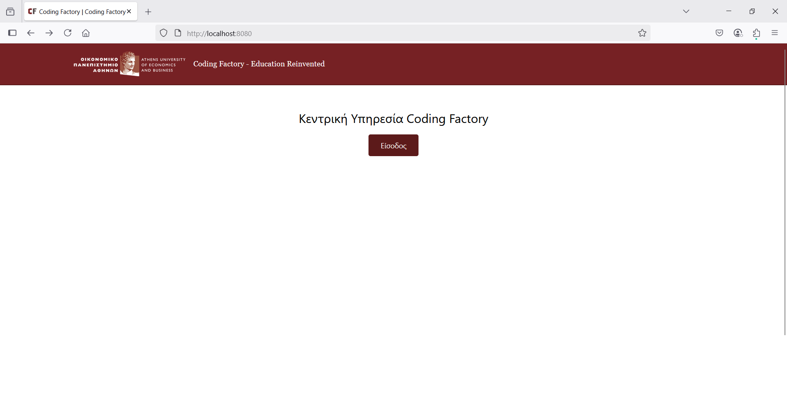
- **Admin Dashboard**  
  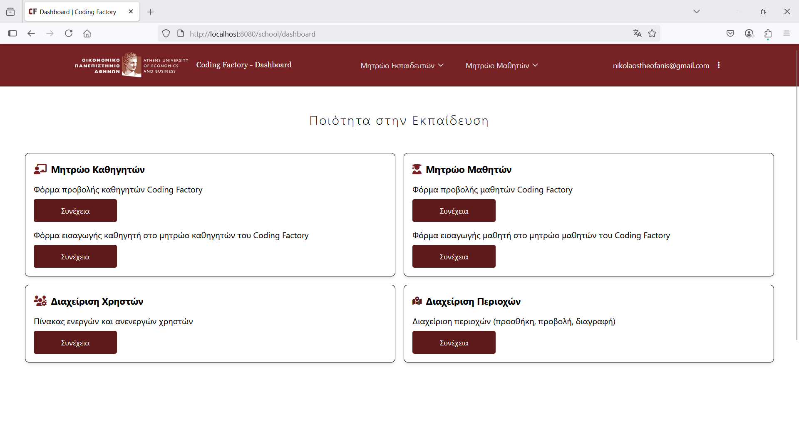
- **Editor Dashboard**  
  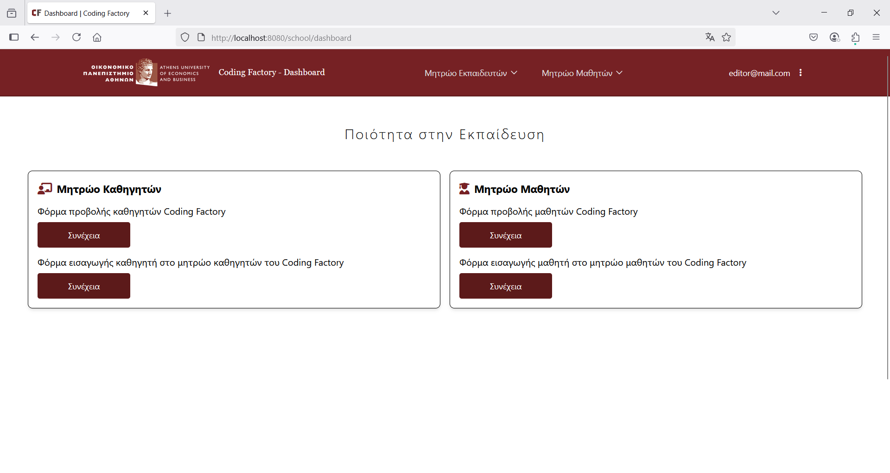
- **Reader Dashboard**  
  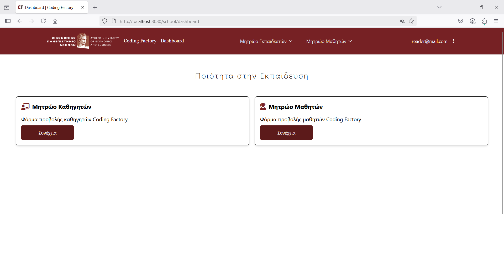

### 👩‍🏫 Teacher Management
- **Paginated List**  
  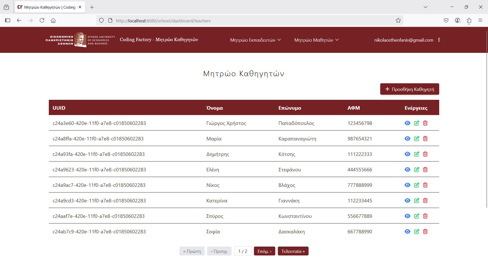
- **Insert Teacher**  
  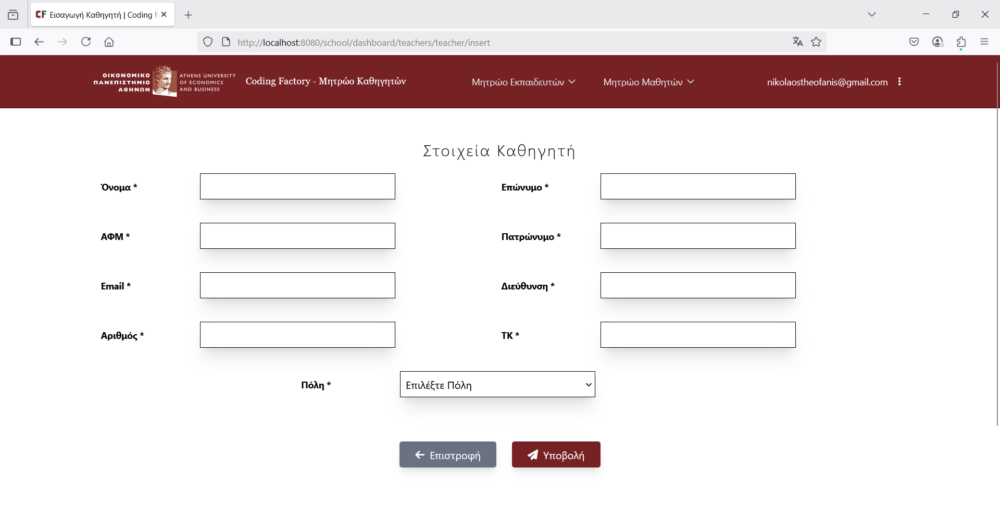
- **Update Teacher**  
  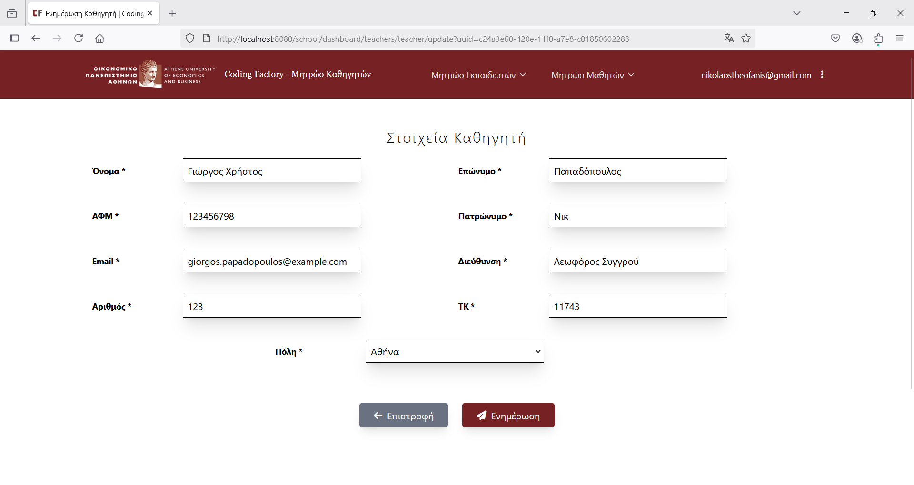
- **Detail View**  
  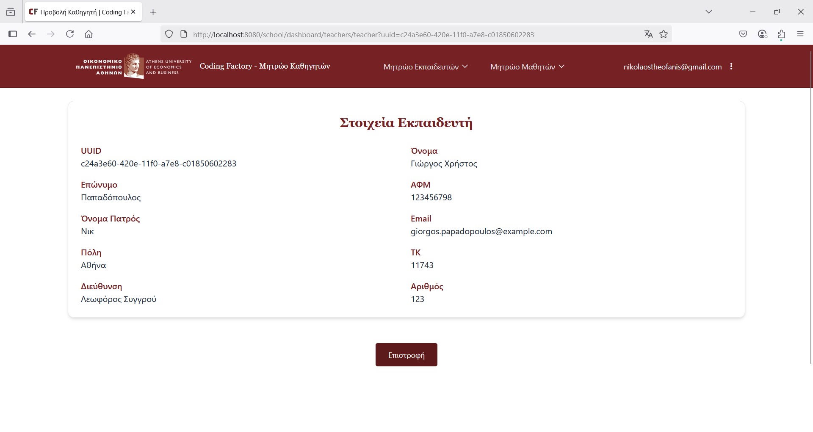

### 🌍 Region Management
- **Regions Overview**  
  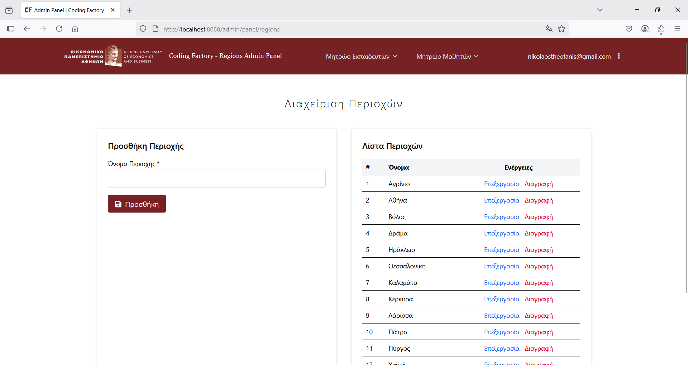
- **Update Region**  
  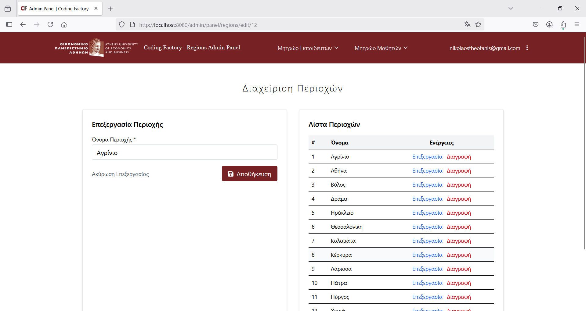

### 👤 User Management (Admin Panel)
- **Insert User**  
  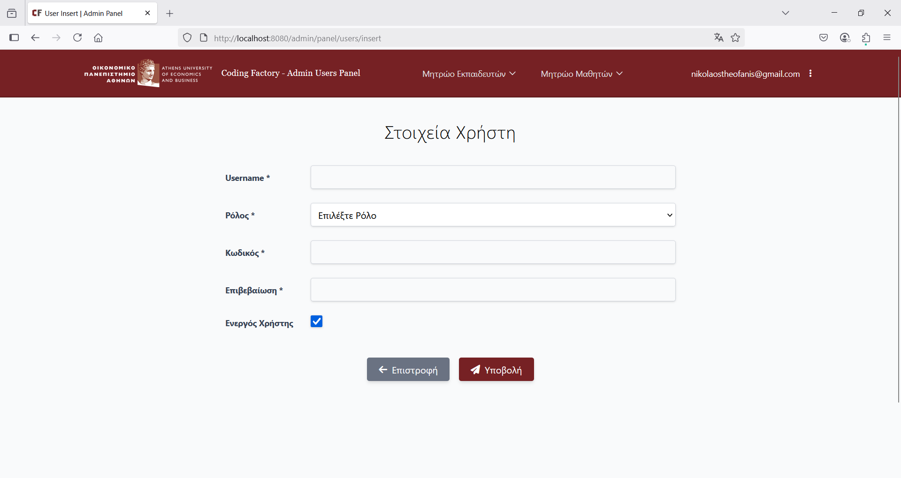
- **User Management**  
  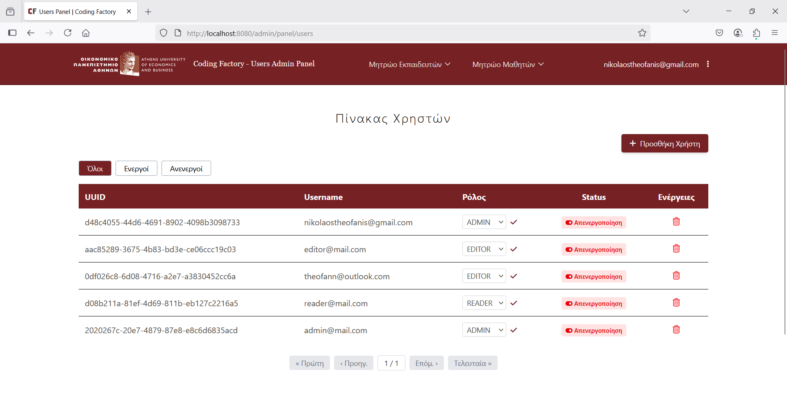


---

## 📄 License

This project is licensed under the MIT License - see the [LICENSE](licence.txt) file for details.